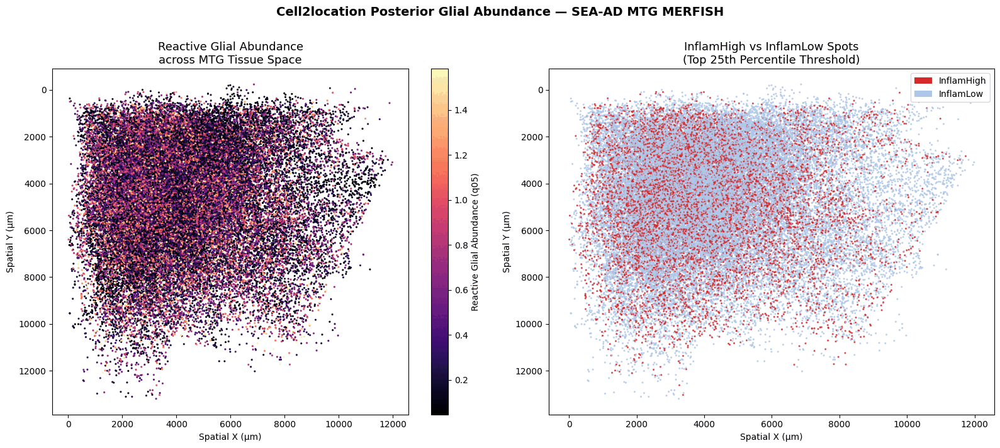
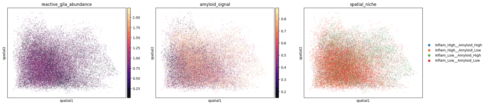
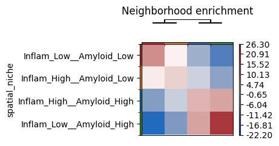
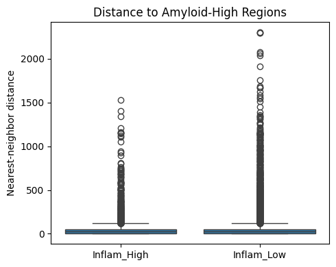
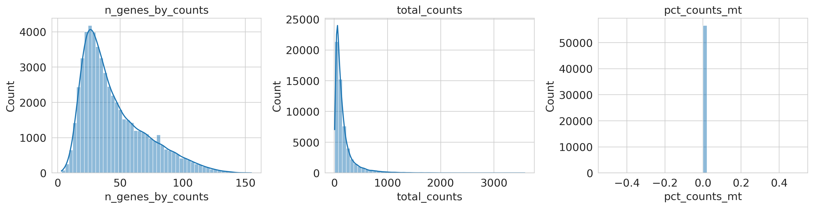
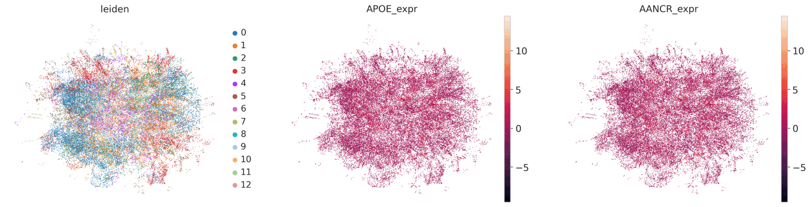
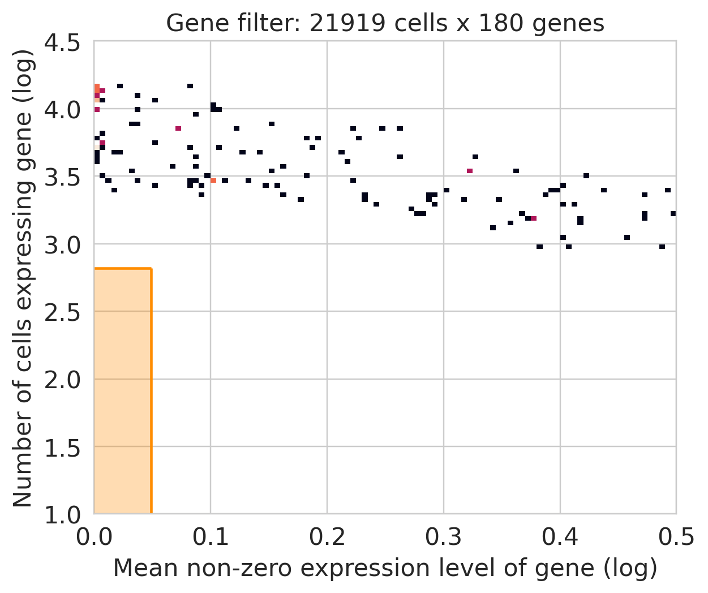

<picture>
  <source media="(prefers-color-scheme: dark)" srcset="assets/visual-abstract-dark.svg">
  
</picture>

<h1 align="center">Spatially-Resolved Multi-Omics Integration in Alzheimer's Disease</h1>

<p align="center">
  Single-cell and spatial transcriptomics integrated with Cell2location to test whether APOE-linked reactive glia organize around amyloid pathology
</p>

<p align="center">
  
  
  
  
  
</p>

<p align="center">
  <a href="#overview">Overview</a> &nbsp;·&nbsp; <a href="#key-results">Key results</a> &nbsp;·&nbsp; <a href="#figures">Figures</a> &nbsp;·&nbsp; <a href="#pipeline-architecture">Pipeline</a> &nbsp;·&nbsp; <a href="#environment-setup">Environment</a> &nbsp;·&nbsp; <a href="#limitations">Limitations</a>
</p>

---

## At a glance

| **45,055** | **12** | **11,264** | **p = 9.8e-5** | **ρ = −0.013** |
|:---:|:---:|:---:|:---:|:---:|
| MERFISH spots after QC | glial state signatures | Inflam_High spots | amyloid proximity (Mann-Whitney) | glia vs amyloid (Spearman) |

> **Take-home:** Cell2location maps 12 glial states across 45,055 MERFISH spots, and inflammation-high spots sit slightly closer to amyloid than inflammation-low spots. However, the effect is small and the tissue-wide correlation is negligible, so this run is best read as a reproducible framework with an initial signal, ready to scale to the full 1.89 million-cell atlas.

## Skills demonstrated

| Area | Evidence in this repository |
|---|---|
| **Spatial transcriptomics** | SEA-AD MERFISH processing, Squidpy neighborhood enrichment and nearest-neighbor proximity analysis |
| **Probabilistic modeling** | Cell2location negative binomial reference regression and hierarchical Bayesian spatial mapping with Pyro variational inference |
| **Single-cell analysis** | Scanpy quality control, normalization, PCA, UMAP and Leiden clustering, plus glial reference extraction |
| **Multi-omics integration** | An APOE-linked AANCR proxy from bulk RNA-seq (GSE263862) combined with spatial data |
| **Statistics** | Spearman correlation, Mann-Whitney U testing and rank-biserial effect sizes |
| **HPC-style engineering** | GPU and CPU training, memory-safe sparse matrix sanitization and WSL2 with CUDA passthrough |

## Overview

> **Author:** Brandon Chua  
> **Institution:** Heidelberg University  
> **Date:** 24.05.2026  
> **Status:** Completed (initial run on 3% sample)

This project implements a computational pipeline to map astrocyte and microglia states to Alzheimer's amyloid pathology. Using `Cell2location`, it integrates single-cell and spatial transcriptomics to deconvolute the spatial distribution of glial cells, specifically those driven by the APOE-activating enhancer RNA AANCR, enabling detection of neuroinflammatory states across cortical tissue of the middle temporal gyrus (MTG).

The pipeline was developed on **Windows 11 through WSL2** using a Conda environment named `alzeihmerprojectlinux` with Python 3.10. This WSL2 setup is important because `cell2location`, `pyro-ppl`, and `squidpy` depend on Linux-compatible compiled libraries and PyTorch components that run more reliably in WSL2 than in a native Windows Jupyter session.

---

## Key Results

| Metric | Value |
|---|---|
| Total cells loaded (SEA-AD MERFISH) | 56,552 |
| Cells retained after QC | 45,055 |
| Cell2location reference signatures learned | 12 |
| Reactive glia columns summarized | 8 (astrocyte + microglia) |
| Inflam_High spots (top 25th percentile, threshold 0.8232) | 11,264 |
| Inflam_Low spots | 33,791 |
| Spearman rho (reactive glia vs amyloid signal) | -0.013 (p = 5.06e-03) |
| Mann-Whitney p (Inflam_High proximity to amyloid) | 9.77e-05 |
| Rank-biserial effect size | 0.023 |

The Spearman correlation is statistically significant but negligibly small and negative, which means reactive glial abundance does not monotonically track amyloid signal across all tissue spots. The Mann-Whitney test shows a small but statistically detectable amyloid proximity effect for Inflam_High spots. These findings are best interpreted as a reproducible computational framework and an initial biological signal rather than a strong tissue-wide claim.

---

## Figures

All figures below were exported directly from the executed notebook outputs.



**Reactive glial abundance in tissue space.** The left panel shows the summed astrocyte and microglia posterior abundance (q05) at every MERFISH spot, while the right panel splits spots into Inflam_High (top 25%) and Inflam_Low.



**Spatial niches.** Reactive glia abundance and the amyloid signal are combined into four niches (Inflam_High or Inflam_Low, crossed with Amyloid_High or Amyloid_Low) for neighborhood testing with Squidpy.

<p>
  
  
</p>

**Neighborhood enrichment and amyloid proximity.** Squidpy z-scores show which niches neighbor each other more often than expected by chance, and the box plot compares nearest-neighbor distances to amyloid-high regions (Mann-Whitney p = 9.77e-05, rank-biserial 0.023).

<details>
<summary><b>Quality control, clustering and model training figures</b></summary>

<br>







</details>

---

## Biological Background

A central question in Alzheimer's disease biology is whether glial inflammatory states are spatially organized around pathology. APOE is a major genetic and molecular risk axis in Alzheimer's disease and is strongly connected to astrocyte and microglial biology. AANCR is treated here as an APOE-linked regulatory signal.

AANCR may not be directly measured in the targeted MERFISH panel, so the notebook uses GSE263862 to infer an AANCR-like proxy from APOE-correlated noncoding RNA behavior when direct AANCR measurement is unavailable.

---

## Data

### 1. Single-Cell Reference Data (GSE263862)

RNA-seq reference data capturing AANCR and APOE expression profiles in astrocytes and microglia.

- **Accession:** [GSE263862](https://www.ncbi.nlm.nih.gov/geo/query/acc.cgi?acc=GSE263862)
- **Citation:** Wan M, Liu Y, Li D, Snyder RJ et al. *The enhancer RNA, AANCR, regulates APOE expression in astrocytes and microglia.* Nucleic Acids Research. 2024 Sep 23;52(17):10235-10254. PMID: [39162226](https://pubmed.ncbi.nlm.nih.gov/39162226/)

### 2. Spatial Transcriptomics Data (SEA-AD MERFISH)

High-resolution spatial mapping of the human middle temporal gyrus, capturing localized gene expression and Alzheimer's neuropathology. The full SEA-AD object contains 1,887,729 cells. This analysis uses a fixed 3 percent random sample for the executed local run.

- **Source:** [AWS Open Data Registry](https://registry.opendata.aws/allen-sea-ad-atlas/)
- **Required citation statement:** Seattle Alzheimer's Disease Brain Cell Atlas (SEA-AD) from https://registry.opendata.aws/allen-sea-ad-atlas

---

## Pipeline Architecture

```text
SEA-AD MERFISH (.h5ad)          GSE263862 (RNA counts .tsv)
        |                                  |
  3% subsample                   APOE / AANCR scoring
  56,552 -> 45,055 cells         (mygene Entrez mapping)
        |                                  |
        +------------- integrate ----------+
                           |
               Quality Control (Scanpy)
               min_genes=10, min_counts=50
               max_mito=20%
                           |
             Normalization + Log1p
             Dimensionality Reduction (PCA, UMAP)
             Leiden Clustering (resolution=0.6)
                           |
              Glial Reference Split
              Annotation: Supertype / Subclass
              Marker fallback: GFAP, TMEM119
              22,062 glial cells, 12 stable labels
                           |
          Cell2location Reference Regression (GPU)
          RegressionModel, 250 epochs
          12 glial Supertype signatures learned
                           |
          Cell2location Spatial Mapping (CPU)
          45,055 MERFISH spots x 180 genes x 12 states
          5,000 epochs, batch_size=2500
                           |
            Reactive Glia Score
            Sum of 8 astrocyte/microglia posterior columns
            Threshold at 75th percentile -> Inflam_High / Inflam_Low
                           |
          Spatial Statistics (Squidpy + SciPy)
          Spearman correlation
          Mann-Whitney U test + rank-biserial effect size
```

---

## Model Details

### Cell2location Stage 1: Reference Regression

This stage estimates the basal expression signature of each glial subpopulation, for example `Astro_1` or `Micro-PVM_2`. It uses a Negative Binomial regression model to calculate a reference signature matrix while reducing technical noise and batch effects. In this run, the reference model was trained for 250 epochs on GPU.

### Cell2location Stage 2: Spatial Mapping

This stage infers the abundance of each learned glial state at every spatial location. It uses a hierarchical Bayesian model through `pyro`, with non-negative abundance constraints and variational inference across 45,055 spatial locations. In this run, the spatial mapping stage was trained for 5,000 epochs on CPU to reduce the chance of memory crashes during posterior export.

### Memory Optimization Strategy

- **Glial cell filtering:** Extracts astrocytes, microglia, and oligodendrocytes using `Supertype` annotations, with a 95th percentile marker-based fallback using `GFAP` and `TMEM119`.
- **Sparse integer sanitization:** Uses a low-memory sparse cleaner named `sanitize_sparse_matrix` to enforce safe count-like values in float32 format.
- **Stability thresholds:** Clips expression signatures at `1e-4` to prevent PyTorch Gamma distribution underflow.
- **Hardware fallbacks:** Detects GPU automatically when available. The notebook uses GPU for the reference stage and CPU for the large spatial stage.

---

## Core Script

```python
# ----------------------------
# 0) Imports + Hardware Check
# ----------------------------
import numpy as np
import pandas as pd
import scipy.sparse as sparse
import pyro
import torch
from cell2location.models import RegressionModel, Cell2location

pyro.clear_param_store()

print("=== HARDWARE CHECK ===")
if torch.cuda.is_available():
    print(f"GPU Available: {torch.cuda.get_device_name(0)}")
    accelerator_type = "gpu"
else:
    print("GPU NOT Available. Falling back to CPU.")
    accelerator_type = "cpu"

# ----------------------------
# 1) Robust Glial Reference Split
# ----------------------------
def split_reference_spatial(adata_in):
    obs = adata_in.obs.copy()
    glial_mask = pd.Series(False, index=obs.index)
    for col in ["broad_cell_type", "Subclass", "Supertype", "Class", "cell_type"]:
        if col in obs.columns:
            col_mask = obs[col].astype(str).str.contains(
                "astro|micro|glia|oligodendro", case=False, na=False
            )
            glial_mask |= col_mask
    if glial_mask.sum() == 0:
        astro_markers = ["GFAP", "AQP4", "ALDH1L1", "S100B"]
        micro_markers = ["TMEM119", "P2RY12", "CSF1R", "C1QA"]
        # marker scoring logic omitted here; see notebook
        glial_mask = (astro_score > np.percentile(astro_score, 95)) | \
                     (micro_score > np.percentile(micro_score, 95))
    sp_mask = pd.Series(True, index=obs.index) if "spatial" in adata_in.obsm \
              else pd.Series(False, index=obs.index)
    return adata_in[glial_mask].copy(), adata_in[sp_mask].copy()

adata_ref, adata_sp = split_reference_spatial(adata)

# ----------------------------
# 2) Memory-Safe Sparse Integer Sanitization
# ----------------------------
def sanitize_sparse_matrix(data_obj):
    X_sparse = data_obj.X.tocsr() if sparse.issparse(data_obj.X) else sparse.csr_matrix(data_obj.X)
    data = X_sparse.data
    data = np.nan_to_num(data, nan=0.0, posinf=0.0, neginf=0.0)
    data = np.clip(np.round(data), 0, None)
    X_sparse.data = data.astype(np.float32)
    X_sparse.eliminate_zeros()
    return X_sparse

adata_ref.layers["counts"] = sanitize_sparse_matrix(adata_ref)
adata_sp.layers["counts"] = sanitize_sparse_matrix(adata_sp)

# ----------------------------
# 3) Train Reference Signature Model
# ----------------------------
RegressionModel.setup_anndata(
    adata=adata_ref,
    layer="counts",
    labels_key="cell2loc_label",
    batch_key="batch"
)
reg_model = RegressionModel(adata_ref)
reg_model.train(max_epochs=250, accelerator=accelerator_type)

adata_ref = reg_model.export_posterior(
    adata_ref,
    sample_kwargs=dict(num_samples=1000, batch_size=1000)
)

cell_state_df = pd.DataFrame(
    adata_ref.varm["means_per_cluster_mu_fg"],
    index=adata_ref.var_names,
    columns=adata_ref.uns["mod"]["factor_names"]
)

# ----------------------------
# 4) Spatial Mapping via Variational Inference
# ----------------------------
common_genes = adata_sp.var_names.intersection(cell_state_df.index)
adata_sp = adata_sp[:, list(common_genes)].copy()
cell_state_df = (
    cell_state_df.loc[list(common_genes)]
    .fillna(0.0)
    .clip(lower=1e-4)
    .astype(np.float32)
)

Cell2location.setup_anndata(adata=adata_sp, layer="counts", batch_key="batch")

c2l_model = Cell2location(
    adata_sp,
    cell_state_df=cell_state_df,
    N_cells_per_location=10,
    detection_alpha=20
)

c2l_model.train(
    max_epochs=5000,
    train_size=1.0,
    batch_size=2500,
    accelerator="cpu"
)

adata_sp = c2l_model.export_posterior(
    adata_sp,
    sample_kwargs=dict(num_samples=100, batch_size=500)
)

# ----------------------------
# 5) Reactive Glia Score + Spatial Stats
# ----------------------------
abundance_key = "q05_cell_abundance_w_sf"
abund = pd.DataFrame(adata_sp.obsm[abundance_key], index=adata_sp.obs_names)
inflam_cols = [
    c for c in abund.columns
    if any(t in str(c).lower() for t in ["microglia", "astrocyte"])
]
adata_sp.obs["reactive_glia_abundance"] = abund[inflam_cols].sum(axis=1)
```

---

## Environment Setup

Run all commands inside WSL2.

```bash
# Step 1: Activate your environment
conda activate alzeihmerprojectlinux

# Step 2: Install PyTorch with CUDA 11.8 support
pip install torch torchvision torchaudio --index-url https://download.pytorch.org/whl/cu118

# Step 3: Install pyro-ppl
pip install pyro-ppl

# Step 4: Install cell2location
pip install cell2location

# Step 5: Install squidpy and scanpy
pip install squidpy scanpy

# Step 6: Install remaining dependencies
pip install mygene leidenalg python-igraph ipywidgets h5py tqdm anndata psutil

# Step 7: Register the Conda environment as a Jupyter kernel
pip install ipykernel
python -m ipykernel install --user --name alzeihmerprojectlinux --display-name "Python (alzeihmerprojectlinux)"

# Step 8: Launch Jupyter from within WSL
jupyter notebook
```

After installation, select the kernel named **Python (alzeihmerprojectlinux)** from the Jupyter Kernel menu.

### Why WSL2 is Required

1. `cell2location` relies on Pyro and PyTorch components that are most reliable on Linux.
2. `squidpy` depends on spatial and HDF5-linked libraries that are more stable in Linux.
3. `leidenalg` depends on `igraph` binaries that are easier to install in Linux.
4. CUDA support for the RTX 4060 Laptop GPU is available through WSL2 GPU passthrough.

---

## Hardware Requirements

| Component | Minimum | Used in This Run |
|---|---|---|
| RAM | 16 GB | Memory pressure observed during spatial posterior export |
| GPU | Optional but recommended | NVIDIA GeForce RTX 4060 Laptop GPU |
| Storage | ~10 GB for raw data + outputs | Local Windows storage mounted through WSL2 |
| OS | Linux or WSL2 on Windows | Windows 11 + WSL2 |

The reference regression model was trained on GPU. The spatial mapping model was trained on CPU for stability during the large posterior export step. The full SEA-AD object still requires HPC resources for practical large-scale runs.

---

## Limitations

- **3 percent sample:** Results may not fully represent the complete SEA-AD object.
- **180-gene MERFISH panel:** Limits Cell2location deconvolution precision and may merge closely related glial states.
- **AANCR proxy:** Direct AANCR measurement was not available in the MERFISH panel, so the analysis uses an APOE-linked proxy.
- **Small effect sizes:** The observed spatial effects are statistically detectable but biologically modest.

---

## Recommended Next Steps

1. Run the full pipeline on the **complete SEA-AD MERFISH object** using HPC resources.
2. Replace the proxy with a **direct AANCR measurement** if available.
3. Perform **sensitivity analyses** across QC thresholds, abundance cutoffs, and donor subsets.

---

## Notebook Structure

1. Methods: Environment and Reproducibility
2. Methods: Hardware Check
3. Methods: Imports and Configuration
4. Methods: Data Loading and Multi-Omics Integration
5. Results: SEA-AD Cohort Audit
6. Methods: Quality Control Diagnostics
7. Results: Count Matrix Integrity Check
8. Methods: Normalization and Log Transformation
9. Methods and Results: Dimensionality Reduction and Clustering
10. Methods and Results: Cell-State Definition
11. Methods and Results: Cell2location Reference Training
12. Methods and Results: Cell2location Spatial Mapping
13. Methods and Results: Spatial Statistics
14. Discussion

---

## License

This repository contains analysis code only. Raw data must be obtained directly from the original data sources and cited accordingly. Do not redistribute raw data files.
